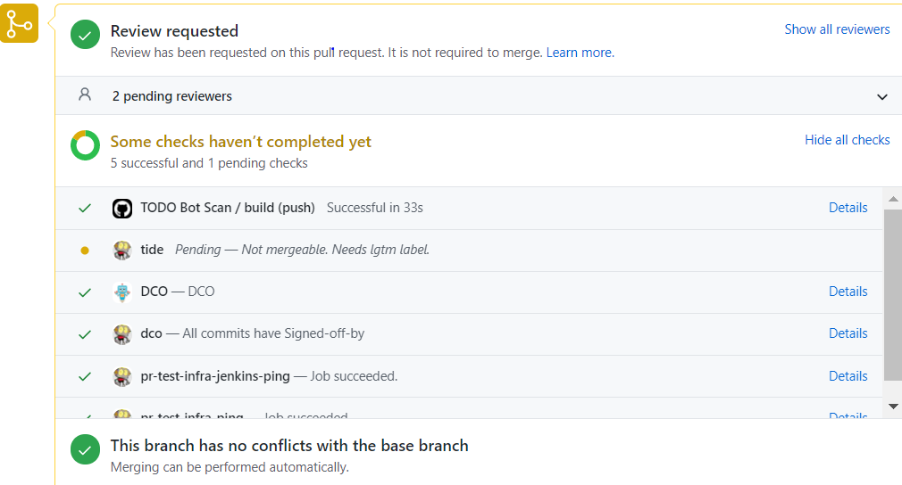

# Onboarding Repositories to Test-Infra

## Overview

Onboarding repositories to Open Enclave's Prow instance is relatively simple assuming you need no customization and the repo belongs to the Open Enclave organization. All you need to do is add an OWNERS files to the root of your repository.

A typical OWNERS file looks like:

```yaml
approvers:
  - alice
  - bob     # this is a comment
reviewers:
  - alice
  - carol   # this is another comment
  - sig-foo # this is an alias
```

They are used to designate responsibility over different parts of the Open Enclave codebase. More can be read about how these work [here](../../docs/owners.md). If your repo belongs to the organization and has this file in place, you will get this automation out of the box in the style of /foo commands:

## Default plugins

| Command                                                                                 	| Example                          	| Description                                                                                                                                                                                                    	| Who Can Use                                                                                                                                                           	| Plugin                	|
|-----------------------------------------------------------------------------------------	|----------------------------------	|----------------------------------------------------------------------------------------------------------------------------------------------------------------------------------------------------------------	|-----------------------------------------------------------------------------------------------------------------------------------------------------------------------	|-----------------------	|
|    <br>/test ?                                                                          	| /test ?                          	|    <br>List available test job(s) for a   trusted PR.                                                                                                                                                          	|    <br>Anyone can trigger this command on a   trusted PR.                                                                                                             	|    TRIGGER            	|
|                                                                                         	|                                  	|                                                                                                                                                                                                                	|                                                                                                                                                                       	|                       	|
|    <br>/retest                                                                          	| /retest                          	|    <br>Rerun test jobs that have failed.                                                                                                                                                                       	|    <br>Anyone can trigger this command on a   trusted PR.                                                                                                             	|    TRIGGER            	|
|                                                                                         	|                                  	|                                                                                                                                                                                                                	|                                                                                                                                                                       	|                       	|
|    <br>/test [\|all]                                                                    	| /test all                        	|    <br>Manually starts a/all test job(s).   Lists all possible job(s) when no jobs/an invalid job are specified.                                                                                               	|    <br>Anyone can trigger this command on a   trusted PR.                                                                                                             	|    TRIGGER            	|
|                                                                                         	| /test   pull-bazel-test          	|                                                                                                                                                                                                                	|                                                                                                                                                                       	|                       	|
|    <br>/retitle                                                                         	| /retitle New Title               	|    <br>Edits the pull request or issue title.                                                                                                                                                                  	|    <br>Collaborators on the repository.                                                                                                                               	|    RETITLE            	|
|                                                                                         	|                                  	|                                                                                                                                                                                                                	|                                                                                                                                                                       	|                       	|
|    <br>/lgtm [cancel] or GitHub Review action                                           	| /lgtm                            	|    <br>Adds or removes the 'lgtm' label which   is typically used to gate merging.                                                                                                                             	|    <br>Collaborators on the repository.   '/lgtm cancel' can be used additionally by the PR author.                                                                   	|    LGTM               	|
|                                                                                         	| /lgtm cancel                     	|                                                                                                                                                                                                                	|                                                                                                                                                                       	|                       	|
|                                                                                         	| 'Approve' or   'Request Changes' 	|                                                                                                                                                                                                                	|                                                                                                                                                                       	|                       	|
|    <br>/check-dco                                                                       	| /check-dco                       	|    <br>Forces rechecking of the DCO status.                                                                                                                                                                    	|    <br>Anyone                                                                                                                                                         	|    DCO                	|
|                                                                                         	|                                  	|                                                                                                                                                                                                                	|                                                                                                                                                                       	|                       	|
|    <br>/check-cla                                                                       	| /check-cla                       	|    <br>Forces rechecking of the CLA status.                                                                                                                                                                    	|    <br>Anyone                                                                                                                                                         	|    CLA                	|
|                                                                                         	|                                  	|                                                                                                                                                                                                                	|                                                                                                                                                                       	|                       	|
|    <br>/[un]cc [[@]...]                                                                 	| /cc                              	|    <br>Requests a review from the user(s).                                                                                                                                                                     	|    <br>Anyone can use the command, but the   target user(s) must be a member of the org that owns the repository.                                                     	|    ASSIGN             	|
|                                                                                         	| /uncc                            	|                                                                                                                                                                                                                	|                                                                                                                                                                       	|                       	|
|                                                                                         	| /cc   @spongebob                 	|                                                                                                                                                                                                                	|                                                                                                                                                                       	|                       	|
|                                                                                         	| /cc   spongebob patrick          	|                                                                                                                                                                                                                	|                                                                                                                                                                       	|                       	|
|    <br>/[un]assign [[@]...]                                                             	| /assign                          	|    <br>Assigns assignee(s) to the PR                                                                                                                                                                           	|    <br>Anyone can use the command, but the   target user(s) must be an org member, a repo collaborator, or should have   previously commented on the issue or PR.     	|    ASSIGN             	|
|                                                                                         	| /unassign                        	|                                                                                                                                                                                                                	|                                                                                                                                                                       	|                       	|
|                                                                                         	| /assign   @spongebob             	|                                                                                                                                                                                                                	|                                                                                                                                                                       	|                       	|
|                                                                                         	| /assign   spongebob patrick      	|                                                                                                                                                                                                                	|                                                                                                                                                                       	|                       	|
|    <br>/approve [no-issue\|cancel]                                                      	| /approve                         	|    <br>Approves a pull request                                                                                                                                                                                 	|    <br>Users listed as 'approvers' in   appropriate OWNERS files.                                                                                                     	|    APPROVE            	|
|                                                                                         	| /approve   no-issue              	|                                                                                                                                                                                                                	|                                                                                                                                                                       	|                       	|
|    <br>/auto-cc                                                                         	| /auto-cc                         	|    <br>Manually request reviews from   reviewers for a PR. Useful if OWNERS file were updated since the PR was   opened.                                                                                       	|    <br>Anyone                                                                                                                                                         	|    BLUNDERBUSS        	|
|    <br>/[remove-](help\|good-first-issue)                                               	| /help                            	|    <br>Applies or removes the 'help wanted'   and 'good first issue' labels to an issue.                                                                                                                       	|    <br>Anyone can trigger this command on a   PR.                                                                                                                     	|    HELP               	|
|                                                                                         	| /remove-help                     	|                                                                                                                                                                                                                	|                                                                                                                                                                       	|                       	|
|                                                                                         	| /good-first-issue                	|                                                                                                                                                                                                                	|                                                                                                                                                                       	|                       	|
|                                                                                         	| /remove-good-first-issue         	|                                                                                                                                                                                                                	|                                                                                                                                                                       	|                       	|
|    <br>/[un]hold [cancel]                                                               	| /hold                            	|    <br>Adds or removes the   `do-not-merge/hold` Label which is used to indicate that the PR should not be   automatically merged.                                                                             	|    <br>Anyone can use the /hold command to   add or remove the 'do-not-merge/hold' Label.                                                                             	|    HOLD               	|
|                                                                                         	| /hold cancel                     	|                                                                                                                                                                                                                	|                                                                                                                                                                       	|                       	|
|                                                                                         	| /unhold                          	|                                                                                                                                                                                                                	|                                                                                                                                                                       	|                       	|
|    <br>/[remove-](area\|committee\|kind\|language\|priority\|sig\|triage\|wg\|label)    	| /kind bug                        	|    <br>Applies or removes a label from one of   the recognized types of labels.                                                                                                                                	|    <br>Anyone can trigger this command on a   PR.                                                                                                                     	|    LABEL              	|
|                                                                                         	| /remove-area   prow              	|                                                                                                                                                                                                                	|                                                                                                                                                                       	|                       	|
|                                                                                         	| /sig testing                     	|                                                                                                                                                                                                                	|                                                                                                                                                                       	|                       	|
|                                                                                         	| /language zh                     	|                                                                                                                                                                                                                	|                                                                                                                                                                       	|                       	|
|                                                                                         	| /label   foo-bar-baz             	|                                                                                                                                                                                                                	|                                                                                                                                                                       	|                       	|
|    <br>/close                                                                           	| /close                           	|    <br>Closes an issue or PR.                                                                                                                                                                                  	|    <br>Authors and collaborators on the   repository can trigger this command.                                                                                        	|    LIFECYCLE          	|
|    <br>/reopen                                                                          	| /reopen                          	|    <br>Reopens an issue or PR                                                                                                                                                                                  	|    <br>Authors and collaborators on the   repository can trigger this command.                                                                                        	|    LIFECYCLE          	|
|    <br>/[remove-]lifecycle                                                              	| /lifecycle frozen                	|    <br>Flags an issue or PR as   frozen/stale/rotten                                                                                                                                                           	|    <br>Anyone can trigger this command.                                                                                                                               	|    LIFECYCLE          	|
|                                                                                         	| /remove-lifecycle   stale        	|                                                                                                                                                                                                                	|                                                                                                                                                                       	|                       	|
|    <br>/milestone or /milestone clear                                                   	| /milestone v1.10                 	|    <br>Updates the milestone for an issue or   PR                                                                                                                                                              	|    <br>Members of the milestone maintainers   GitHub team can use the '/milestone' command.                                                                           	|    MILESTONE          	|
|                                                                                         	| /milestone   v1.9                	|                                                                                                                                                                                                                	|                                                                                                                                                                       	|                       	|
|                                                                                         	| /milestone   clear               	|                                                                                                                                                                                                                	|                                                                                                                                                                       	|                       	|
|    <br>/status   (approved-for-milestone\|in-progress\|in-review)                       	| /status approved-for-milestone   	|    <br>Applies the 'status/' label to a PR.                                                                                                                                                                    	|    <br>Members of the milestone maintainers   GitHub team can use the '/status' command. This team is specified in the   config by providing the GitHub team's ID.    	|    MILESTONESTATUS    	|
|                                                                                         	| /status   in-progress            	|                                                                                                                                                                                                                	|                                                                                                                                                                       	|                       	|
|                                                                                         	| /status   in-review              	|                                                                                                                                                                                                                	|                                                                                                                                                                       	|                       	|
|    <br>/override [context]                                                              	| /override pull-repo-whatever     	|    <br>Forces a github status context to   green (one per line).                                                                                                                                               	|    <br>Repo administrators.                                                                                                                                           	|    OVERRIDE           	|
|                                                                                         	| /override   ci/circleci          	|                                                                                                                                                                                                                	|                                                                                                                                                                       	|                       	|
|                                                                                         	| /override   deleted-job          	|                                                                                                                                                                                                                	|                                                                                                                                                                       	|                       	|
|    <br>/project , /project , or /project clear                                          	| /project 0.5.0                   	|    <br>Add an issue or PR to a project board   and column                                                                                                                                                      	|    <br>Members of the project maintainer   GitHub team can use the '/project' command.                                                                                	|    PROJECT            	|
|                                                                                         	| /project   0.5.0 To do           	|                                                                                                                                                                                                                	|                                                                                                                                                                       	|                       	|
|                                                                                         	| /project   clear 0.4.0           	|                                                                                                                                                                                                                	|                                                                                                                                                                       	|                       	|
|    <br>/release-note-none                                                               	| /release-note-none               	|    <br>Adds   the 'release-note-none' label to indicate that the PR does not warrant a   release note. This is deprecated and ideally the release note process should   be followed in the PR body instead.    	|    <br>PR Authors and Org Members.                                                                                                                                    	|    RELEASE-NOTE       	|
|    <br>/[un]shrug                                                                       	| /shrug                           	|    <br>¯\_(ツ)_/¯                                                                                                                                                                                              	|    <br>Anyone, ¯\_(ツ)_/¯                                                                                                                                             	|    SHRUG              	|
|                                                                                         	| /unshrug                         	|                                                                                                                                                                                                                	|                                                                                                                                                                       	|                       	|
|    <br>/skip                                                                            	| /skip                            	|    <br>Cleans up GitHub stale commit statuses   for non-blocking jobs on a PR.                                                                                                                                 	|    <br>Anyone can trigger this command on a   PR.                                                                                                                     	|    SKIP               	|
|    <br>/[remove-]stage                                                                  	| /stage alpha                     	|    <br>Labels the stage of an issue as   alpha/beta/stable                                                                                                                                                     	|    <br>Anyone can trigger this command.                                                                                                                               	|    STAGE              	|
|                                                                                         	| /remove-stage   alpha            	|                                                                                                                                                                                                                	|                                                                                                                                                                       	|                       	|
|    <br>/ok-to-test                                                                      	| /ok-to-test                      	|    <br>Marks a PR as 'trusted' and starts   tests.                                                                                                                                                             	|    <br>Members of the trusted organization   for the repo.                                                                                                            	|    TRIGGER            	|
|    <br>/verify-owners                                                                   	| /verify-owners                   	|    <br>do-not-merge/invalid-owners-file                                                                                                                                                                        	|    <br>Anyone                                                                                                                                                         	|    VERIFY-OWNERS      	|
## Defaults

This will give some basic defaults as well, such as a welcome message for new contributors pointing them towards contributing documentations and the likes.

```yaml
welcome:
- repos:
  - openenclave-ci/oeedger8r-cpp
  - openenclave-ci/test-infra
  - openenclave-ci/openenclave
  message_template: "Welcome @{{.AuthorLogin}}! <br><br>It looks like this is your first PR to <a href='https://github.com/{{.Org}}/{{.Repo}}'>{{.Org}}/{{.Repo}}</a> 🎉. Please refer to our [pull request process documentation](404) to help your PR have a smooth ride to approval. <br><br>You will be prompted by a bot to use commands during the review process. Do not be afraid to follow the prompts! It is okay to experiment. [Here is the bot commands documentation](https://go.k8s.io/bot-commands). <br><br>You can also check if {{.Org}}/{{.Repo}} has [its own contribution guidelines](https://github.com/{{.Org}}/{{.Repo}}/tree/master/CONTRIBUTING.md). <br><br>You may want to refer to our [testing guide](404) if you run into trouble with your tests not passing. <br><br>If you are having difficulty getting your pull request seen, please follow the [recommended escalation practices](404). We want to make sure your contribution gets all the attention it needs! <br><br>Thank you, and welcome to openenclave. :smiley:"
```

The size plugin is configured as such

```yaml
# Lower bounds in number of lines changed; XS is assumed to be zero.
size:
  s:   10
  m:   30
  l:   100
  xl:  500
  xxl: 1000
```

Tide will check for these queries before attempting to merge, designated by labels. 

```yaml
    - repos:
        - openenclave/test-infra
      labels:
        - lgtm
        - approved
      missingLabels:
        - do-not-merge
        - do-not-merge/hold
        - do-not-merge/invalid-owners-file
        - do-not-merge/work-in-progress
        - needs-rebase
```

## Testing
If you want to check if your repo has been succesfully onboarded, just open up a PR against it and see if the bot is listening.



## Onboarding additional jobs
<TBD>